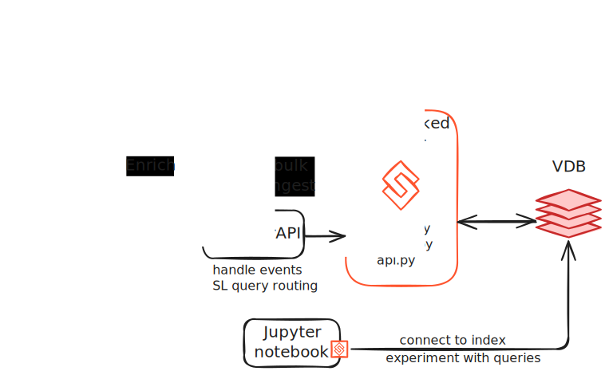

# Ecommerce RecSys

## Executive Summary

This project is a demonstration of a ecommerce session-based recsys system built using Superlinked.
We will outline how you can harness realtime events + product content features + your own data collabarative features to create an advanced recommendation system across site.
Supporing user2item recommendations and item2item recommendation, taking into account:
product image + description, popularity, price, item2vec representations, categories, types and brands.

Try it out : [e-commerce-recsys-recipe.superlinked.io](https://e-commerce-recsys-recipe.superlinked.io/home)


### Key features

- **Example of how to train item2vec on your event data:** - Use events data to extract custom product realtions.
- **Events based system:** - Have a session based recommendation that adjust recommendations in realtime while user surfs the site.
- **Multi modal features:** - Support images, text and categories out of the box with SL.

### Modalities:

- **Images** product images
- **Text** product description
- **Categories** product type, brand, category
- **Numbers** product popularity, price

### Hard-filters
- **Stock** - use `is_active` indicator that will make sure only in stock products are recommended.


## Quick Start

This section provides a step-by-step guide on how to run the whole system locally.

More details are provided below, in the **Tutorial** section.

<div align="center">
  
</div>

### Run item2vec model (Optional)
Skip this if using our dataset as we already trained this model. If using you own dataset, you should train it before proceeding.

Follow the documentation in [item2vec](../e-commerce/item2vec/README.md) to understand the data format and the script assumption.
Then adjust paramters in [config](../e-commerce/item2vec/config.json) and run 
```bash
python item2vec/item2vec.py
```

Upload your `w2v.pickle` and new `products.jsonl` to cloud / keep in local storage.

### Redis VDB

```shell
docker run -d \
  --name redis-vdb-ecom \
  -p 6379:6379 \
  -p 8001:8001 \
  -v $(pwd)/redis-data:/data \
  -e REDIS_ARGS="--appendonly yes --appendfsync everysec" \
  -e REDISINSIGHT_HOST=0.0.0.0 \
  redis/redis-stack:7.4.0-v0
```

Once running, you can access the Redis browser at [localhost:8001/browser](http://localhost:8001/browser/).

For more details on using Redis with Superlinked, refer to the [our docs](https://docs.superlinked.com/run-in-production/index-1/redis).

### Superlinked server

In the project directory

```shell
python3.11 -m venv .venv-server
. .venv-server/bin/activate
pip install -r requirements.txt
APP_MODULE_PATH=superlinked_app python -m superlinked.server
```
API docs will be available at [localhost:8080/docs](http://localhost:8080/docs).

To ingest the dataset, run this command in your terminal:
```shell
curl -X 'POST' \
  'http://localhost:8080/data-loader/product_schema/run' \
  -H 'accept: application/json' \
  -d ''
```

### Run the Wrapper server

In order to handle the advanced capabiliteis of this Recsys, some custome extesntion on top of SL out-of-the-box server is needed.
The wrapper API handles this logic.

In a new shell enter the wrapper dir and run the server
```shell
deactivate
cd wrapper/
python3.11 -m venv .venv-wrapper
. .venv-wrapper/bin/activate
pip install -r requirements.txt
python3 endpoint.py
```
API docs will be available at [localhost:8000/docs](http://localhost:8000/docs).


### Start the UI

In order to interact with the recommendation system we created a mock, static ecommerce store.
Open a new terminal and run the following
```shell
deactivate
cd flask-ui/
python3.11 -m venv .venv-flask
. .venv-flask/bin/activate
pip install -r requirements.txt
python3 run.py
```
The UI store should be exposed at [http://127.0.0.1:5000](http://127.0.0.1:5000)

If you want to run the UI app on WSGI server instead of `python run.py` run
```shell
python -m gunicorn --workers 4 --bind 0.0.0.0:5000 run:app --reload
```

## Tutorial

To configure your superlinked application you need to create a simple python package with few files, we will go though them one by one.
All files contain necessary inline comments, check them out!
Also, feel free to read our docs: [docs.superlinked.com](https://docs.superlinked.com/run-in-production/index/configuring-your-app).

Once you are happy with your local Superlinked setup, you can use config files without changes for your Cloud deployent.
To make transition to the cloud smooth, we provide Superlinked CLI.
[Contact us](https://superlinked.typeform.com/to/LXMRzHWk?typeform-source=hotel-search-recipe) if you want to try it now!

---

[**`__init__.py`**](./superlinked_app/__init__.py)

It's needed to make a python package, you can keep it empty

---

[**`index.py`**](./superlinked_app/index.py)

This file defines three important things:
- object schema: declares names and types of raw attributes - this actually lies in differnt file [schema.py](./superlinked_app/schema.py) but it's part of the index defenition
- vector spaces: bind embedders to schema fields
- index: combines spaces for multi-modal vector search

---

[**`query.py`**](./superlinked_app/query.py)

These two files define superlinked queries used for multi-modal semantic search with Natural Language Interface (NLI) on top.
Our github contains many helpful notebooks that show how to configure superlinked queries:
- [query time weights](https://github.com/superlinked/superlinked/blob/main/notebook/feature/query_time_weights.ipynb)
- [querying options](https://github.com/superlinked/superlinked/blob/main/notebook/feature/querying_options.ipynb)
- [dynamic parameters](https://github.com/superlinked/superlinked/blob/main/notebook/feature/dynamic_parameters.ipynb)

---

[**`api.py`**](./superlinked_app/api.py)

This file sets the following components:
- vector database: in current application we are using Redis.
  We also support [MongoDB and Qdrant](https://docs.superlinked.com/run-in-production/index-1).
- data loader: our data is ingested from gcp bucket
- REST API: our app will provide endpoints for ingestion (bulk and one-by-one) and for querying. More information is in [our docs](https://docs.superlinked.com/run-in-production/index/interacting-with-app-via-api).


## What's next

We publish our recipie as a starting point for your own project.
To better understand all the specifics in this recipie refer to the above documentation and the exploratory [notebooks](../e-commerce/notebooks/).
Going thourgh them will allow you to better understand how to configure the system to run with your custom data.

